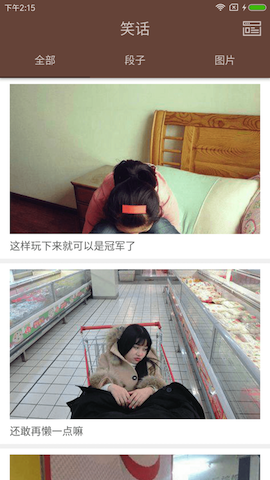

# databindingAdapter-joke
### Joke（笑话app）
项目采用mvp+databinding模式开发。

       

### databindingadapter
使用databindingadapter库将简化在databinding模式开发RecyclerView。

### Download

Download via Gradle:
```gradle
compile 'com.xufeng.databindingadapter:databindingadapter:1.0.0'
```

or Maven:
```xml
<dependency>
  <groupId>com.xufeng.databindingadapter</groupId>
  <artifactId>databindingadapter</artifactId>
  <version>1.0.0</version>
  <type>pom</type>
</dependency>
```

## How does it work?

Create a class ViewHolder (`JokeViewHolder` for example). The method `updateView` will be call with the object, when an update of your view is require:

    public class JokeViewHolder extends BindingViewHolder<JokeDto> {
      public JokeViewHolder(ViewDataBinding viewDataBinding) { super(viewDataBinding);}

      @Override
      protected void updateView(Context context, JokeDto object, int position) {
          getBinding().setVariable(BR.joke, object);
      }
    }

Give this ViewHolder class to the constructor of the adapter (SimpleAdapter) of your [RecyclerView](https://developer.android.com/reference/android/support/v7/widget/RecyclerView.html), with the resource id of your item view and the list of objects:

    BindingRecyclerViewAdapter<JokeDto> adapter = new BindingRecyclerViewAdapter<>(R.layout.joke_item, JokeViewHolder.class);
    recyclerView.setAdapter(adapter);

And that's it!

## License

* [Apache 2.0](http://www.apache.org/licenses/LICENSE-2.0.html)

## Contributing

Please fork this repository and contribute back using
[pull requests](https://github.com/xufengAndroid/XfProject).

Any contributions, large or small, major features, bug fixes, additional
language translations, unit/integration tests are welcomed and appreciated
but will be thoroughly reviewed and discussed.

